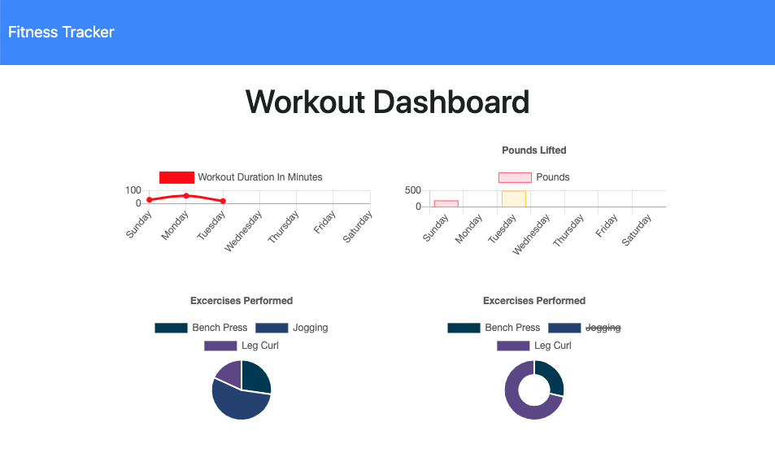

# 17-Fitness-Tracker

## Description
Fitness Traker is a health app that allows the User to create and track daily workouts. The User will be able to log multiple exercies in a workout on a given day and track workout data including name, tupe, weight, sets, reps and duration of exercise.

## Preview

## Badges

## Table of Contents
   * [Installation](#Installation)
   * [Usage](#Usage)
   * [License](#License)
   * [Contribution](#Contribution)
   * [Collaborators](#Collaborators)
   * [Questions](#Questions)

## Installation
The user can access the application via the Heroku link here:

https://glacial-spire-79365.herokuapp.com/?id=5fa13ec31603d70017fbc2ab 

Alternatively, the user can fork the repository, install the necessary dependencies by running the npm i command via the user's command line, and run the app using the node server.js command.

## Usage
The application is simple to use - we would encourage anyone experiencing difficulty to get in touch.

## License
MIT license

## Contribution
The design and content of the application is derived from a review of material provided by Trilogy Education Service in Unit 17, in particular, the solution provided for activity 26 (MiniProject).

## Collaborators
There are many ways in which you can participate in the project, for example:

- Submit bugs and feature requests, and help us verify as they are checked in
- Review source code changes
- Review the documentation and make pull requests for anything from typos to new content

## Questions
Email: christopher.j.natale@gmail.com.
Github Profile: http://github.com/cnat3103